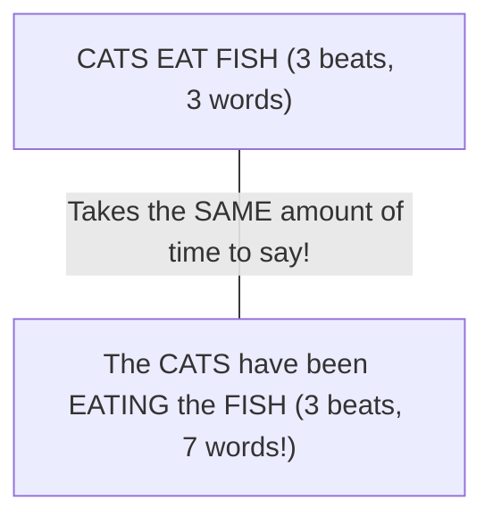

A major shock for English learners is that native speakers do not speak word-by-word like a dictionary. When words are assembled into a sentence, **they physically melt together**.

Understanding **connected speech** and **stress-timed rhythm** is the secret to understanding movies without subtitles and sounding effortlessly natural.

---

## 🎵 Syllable-Timed vs Stress-Timed Rhythm

- **Ukrainian is Syllable-Timed**: Every syllable takes roughly the same amount of time to say, like notes on a piano: *«Ко-жен склад зву-чить од-на-ко-во»*.
- **English is Stress-Timed**: The time between **stressed syllables is equal**, regardless of how many unstressed words are packed between them!

To fit 7 words into the same timeframe as 3 words, native speakers crush the small grammatical words (articles, prepositions, auxiliaries) into **weak forms**.

---

## 📉 Weak Forms & Everyday Reductions

In connected speech, grammatical words lose their full vowel sounds and collapse into the **Schwa `/ə/`**:

| Word | Strong Form (Isolated) | Weak Form (In a Sentence) | Example in Natural Flow |
| :--- | :---: | :---: | :--- |
| **To** | `/tuː/` | **/tə/** | *"I want to go"* → `/aɪ ˈwɑːn.tə ɡoʊ/` |
| **For** | `/fɔːr/` | **/fɚ/** | *"This is for you"* → `/ðɪs ɪz fɚ juː/` |
| **And** | `/ænd/` | **/ən/** or **/n/** | *"Rock and roll"* → `/ˌrɑːk.n̩ˈroʊl/` |
| **Can** | `/kæn/` | **/kən/** | *"I can do it"* → `/aɪ kən ˈduː ɪt/` |
| **Of** | `/ʌv/` | **/əv/** | *"Cup of coffee"* → `/ˈkʌp.əv ˈkɔː.fi/` |
| **Are** | `/ɑːr/` | **/ɚ/** | *"What are you doing?"* → `/wʌt̬ ɚ jə ˈduː.ɪŋ/` |

> [!TIP]
> Notice that **Can** reduces to `/kən/`, but **Can't** NEVER reduces (`/kænt/`). That is how native speakers hear the difference between positive and negative sentences!

---

## 🔗 The 3 Golden Linking Rules

Native speech is a continuous ribbon of sound. Sounds fuse together across word boundaries:

### 1. Consonant to Vowel (Direct Flow)
When a word ends in a consonant and the next word starts with a vowel, the consonant shifts to the second word:
- **Hold on** → pronounced *Hol-don* `/hoʊlˈdɑːn/`
- **Check it out** → pronounced *Che-ki-dout* `/ˌtʃek.ɪˈt̬aʊt/`
- **Not at all** → pronounced *Nah-tə-tall* `/ˌnɑː.t̬əˈtɔːl/`

### 2. Vowel to Vowel (The Intrusive Glides)
When two vowel sounds meet, English inserts a phantom glide sound (**[w]** or **[j]**) to bridge the gap smoothly:
- If the first word ends in a rounded vowel (O, U), add a phantom **[w]**:
  - *"Go away"* → pronounced *Go-**w**-away* `/ˌɡoʊ.w.əˈweɪ/`
  - *"Do it"* → pronounced *Do-**w**-it* `/ˈduː.w.ɪt/`
- If the first word ends in a high front vowel (EE, AY, I), add a phantom **[j]**:
  - *"I am"* → pronounced *I-**y**-am* `/aɪ.j.æm/`
  - *"See it"* → pronounced *See-**y**-it* `/ˈsiː.j.ɪt/`

### 3. Elision (Disappearing Sounds)
When /t/ or /d/ are sandwiched between other consonants, they vanish:
- **Last night** → pronounced *Las’ night* `/læs ˈnaɪt/`
- **Next door** → pronounced *Nex’ door* `/neks ˈdɔːr/`

---

## 🔍 Conversational Sentence Transcriptions

Here is how everyday English sentences look when transcribed in full phonetic reality:

### 1. *"What are you going to do?"*
- **Dictionary Citation**: `/wʌt ɑːr juː ˈɡoʊ.ɪŋ tuː duː/`
- **Conversational Speech**: **`/ˈwʌ.tʃə ɡʌ.nə ˈduː/`** (*Whatcha gonna do?*)
- **Phonetic Shift**: "What are you" fuses into `/wʌtʃə/`, and "going to" reduces to `/ɡʌnə/`.

### 2. *"I should have told you earlier."*
- **Dictionary Citation**: `/aɪ ʃʊd hæv toʊld juː ˈɜːr.li.ɚ/`
- **Conversational Speech**: **`/aɪ ʃʊ.də ˈtoʊl.dʒu ˈɜːr.li.ɚ/`**
- **Phonetic Shift**: "Should have" reduces to *shoulda* `/ʃʊdə/`. The /d/ in "told" fuses with the /j/ in "you" to create the affricate [dʒ] (*told-you* → *tol-joo*).

### 3. *"Could you give me a hand?"*
- **Dictionary Citation**: `/kʊd juː ɡɪv miː ə hænd/`
- **Conversational Speech**: **`/kʊ.dʒə ˈɡɪv.mi.ə ˈhænd/`**
- **Phonetic Shift**: "Could you" assimilates into *could-juh* `/kʊdʒə/`. "Give me" fuses directly with the indefinite article /ə/.

### 4. *"Do you want a cup of coffee?"*
- **Dictionary Citation**: `/duː juː wɑːnt ə kʌp ʌv ˈkɔː.fi/`
- **Conversational Speech**: **`/də.jə ˈwɑː.nə ˈkʌ.pə ˈkɔː.fi/`** (*D'ya wanna cuppa coffee?*)
- **Phonetic Shift**: "Want a" drops the /t/ and becomes *wanna* `/wɑːnə/`. "Cup of" fuses into *cuppa* `/kʌpə/`.

---

## 📚 Sound System Navigation

- **[IPA Atlas (All 44 Sounds)](/phonetics/ipa-chart/)**: The full 44-sound phonetic chart.
- **[Vowels & The Schwa](/phonetics/vowels/)**: Pure monophthongs, tense vs lax sounds, and unstressed reduction.
- **[Diphthongs & Glides](/phonetics/diphthongs/)**: Two-vowel glides and rhotic combinations.
- **[Consonants & Challenging Sounds](/phonetics/consonants/)**: Master TH, W vs V, and the Flap T.
