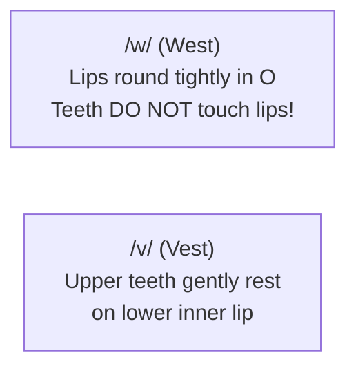

English has **24 consonant phonemes**. While many consonants (like /m, b, d, s/) have close Ukrainian equivalents, several sounds do not exist in Ukrainian phonology and require completely new muscle memory.

Mastering these specific sounds instantly elevates your speech from heavy foreign articulation to effortless, natural fluency.

---

## 1. The TH Sounds: `/θ/` & `/ð/`

The **TH** combination creates two unique dental fricative sounds. To make both, place the tip of your tongue gently **between your upper and lower teeth**:

1. **Voiceless `/θ/`** — pure air whisper (zero throat vibration).
2. **Voiced `/ð/`** — vocal cords vibrate with a distinct buzzing sensation in your neck.

### 🎬 Video Guide: Mouth & Tongue Placement

  <iframe 
    src="https://www.youtube.com/embed/b4wH70sV14w" 
    title="English: How to Pronounce TH Consonants [θ] + [ð]: American Accent" 
    allow="accelerometer; autoplay; clipboard-write; encrypted-media; gyroscope; picture-in-picture; web-share" 
    allowfullscreen
  ></iframe>

  📺 <em>If video doesn't load: <a href="https://www.youtube.com/watch?v=b4wH70sV14w" target="_blank" rel="noopener noreferrer" style="color: var(--accent-blue-primary);">Watch directly on YouTube</a></em>

### Contrast Table: Voiceless vs Voiced TH

| Voiceless `/θ/` (Quiet Whisper) | Meaning | Voiced `/ð/` (Vocal Cord Buzz) | Meaning |
| :--- | :--- | :--- | :--- |
| **Think** `/θɪŋk/` | Думати | **This** `/ðɪs/` | Цей / Ця / Це |
| **Three** `/θriː/` | Три (число) | **That** `/ðæt/` | Той / Та / Те |
| **Thanks** `/θæŋks/` | Дякую | **The** `/ðə/` | Означений артикль |
| **Bath** `/bæθ/` | Ванна | **Breathe** `/briːð/` | Дихати |
| **Birthday** `/ˈbɝːθ.deɪ/` | День народження | **Mother** `/ˈmʌð.ɚ/` | Мама |

> [!CAUTION]
> **Never Substitute**:
> Do not replace `/θ/` with **[s]** (*"sink"* instead of *"think"*) or **[f]** (*"free"* instead of *"three"*).
> Do not replace `/ð/` with **[z]** (*"zis"* instead of *"this"*).

---

## 2. The W vs V Showdown

In Ukrainian, both «в» and «у» can be used interchangeably in certain contexts, but in English, confusing **/w/** and **/v/** creates entirely different words:

| Minimal Pair | Word with /w/ (Round Lips) | Word with /v/ (Teeth on Lip) | Meaning Shift |
| :--- | :--- | :--- | :--- |
| **West vs Vest** | **West** `/west/` (Захід) | **Vest** `/vest/` (Жилетка) | *Go west in your vest.* |
| **Wet vs Vet** | **Wet** `/wet/` (Мокрий) | **Vet** `/vet/` (Ветеринар) | *The wet dog bit the vet.* |
| **Wine vs Vine** | **Wine** `/waɪn/` (Вино) | **Vine** `/vaɪn/` (Лоза) | *Fine wine from the vine.* |
| **Wary vs Very** | **Wary** `/ˈwer.i/` (Обережний) | **Very** `/ˈver.i/` (Дуже) | *Be very wary.* |

> [!TIP]
> **Muscle Drill for `/w/`**:
> Imagine you are whistling or about to kiss someone. Push your lips outward in a tight circle. Breathe out sound, then open into the vowel: *W-W-Water*.

---

## 3. The American Liquid R: Never Roll!

In Ukrainian, the letter «Р» is a vibrant alveolar trill (the tongue tip rapidly taps the roof of the mouth).
In American English, **the tongue tip must NEVER touch or vibrate against the roof of the mouth!**

- **Bunched / Retroflex Position**: The body of the tongue pulls back toward the throat. The sides of the tongue brace against the upper back molars.
- The tongue tip floats freely in the middle of the oral cavity without touching anything.
- **Practice**: *Red, Right, Road, Star, Car, Water*.

---

## 4. Light L vs Dark L

English has two completely distinct ways to pronounce the letter L:

| Type | When it Happens | How to Pronounce | Examples |
| :--- | :--- | :--- | :--- |
| **Light L [l]** | At the beginning of a syllable (before a vowel) | Tip of tongue touches behind top teeth; sound is crisp and light | *light, love, listen, yellow* |
| **Dark L [ɫ]** | At the end of a syllable or before another consonant | Back of the tongue raises toward the soft palate (velarized); heavy throat sound | *milk, feel, ball, table, Apple* |

> [!NOTE]
> Saying *feel* with a Ukrainian soft «ль» (*філь*) sounds foreign. Pull the back of your tongue down and back to make it a deep, hollow Dark L.

---

## 5. The American Flap T [ɾ] & Glottal Stop [ʔ]

In conversational American English, the letter **T** is rarely pronounced with a sharp, crisp burst when it sits between two vowels:

1. **The Flap T [ɾ]**: When T lands between vowel sounds (with the first vowel stressed), it turns into a lightning-fast single tap of the tongue against the palate (similar to a quick single Ukrainian «р»):
   - **Water** → pronounced *WAH-der* `/ˈwɑː.t̬ɚ/`
   - **Better** → pronounced *BEH-der* `/ˈbet̬.ɚ/`
   - **City** → pronounced *SIH-dee* `/ˈsɪt̬.i/`
   - **Party** → pronounced *PAR-dee* `/ˈpɑːr.t̬i/`

2. **The Glottal Stop [ʔ]**: When T is followed by an unstressed /n/ sound, native speakers close their vocal cords completely to stop the air in the throat:
   - **Button** → `/ˈbʌʔ.n̩/` (*buh-’n*)
   - **Mountain** → `/ˈmaʊn.ʔn̩/` (*moun-’n*)
   - **Important** → `/ɪmˈpɔːr.ʔn̩t/`

---

## 6. Silent Consonants (Do Not Pronounce!)

English retains historical spelling from centuries ago. Never pronounce these silent letters:

| Silent Letter | Example Words | Phonetic Reality |
| :---: | :--- | :--- |
| **B** | *doubt, debt, thumb, climb, lamb* | The "b" is 100% silent (*daut, det, thum*). |
| **K** | *knife, know, knee, knock, knight* | Starts directly with the /n/ sound (*nife, no*). |
| **L** | *calm, walk, talk, half, salmon* | Never say the "l" (*cahm, wok, tok, hahf*). |
| **P** | *psychology, pneumonia, receipt* | Starts with /s/ or /n/ (*sychology, receet*). |
| **S** | *island, aisle, debris* | The "s" is invisible (*eye-land, eye-l*). |
| **W** | *write, wrong, answer, sword* | Pronounce directly as /r/ or /s/ (*rite, rong, sord*). |

---

## 📚 Sound System Navigation

- **[IPA Atlas (All 44 Sounds)](/phonetics/ipa-chart/)**: The full phonetic matrix overview.
- **[Vowels & The Schwa](/phonetics/vowels/)**: Master vowel length and the unstressed Schwa `/ə/`.
- **[Diphthongs & Glides](/phonetics/diphthongs/)**: Two-vowel glides and American rhotic combinations.
- **[Connected Speech & Rhythm](/phonetics/connected-speech/)**: How words fuse into smooth natural sentences.
