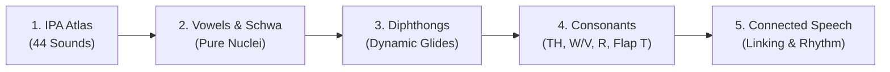

English has only **26 letters**, but it produces **44 distinct sounds (phonemes)**. Because English spelling is historical rather than phonetic, the **International Phonetic Alphabet (IPA)** is the definitive blueprint that tells your mouth exactly how to pronounce any word.

---

## 🧭 How to Read IPA Transcription

Before exploring the 44 sounds, understand the core notation marks:

| Symbol | Name | Example | Practical Meaning |
| :--- | :--- | :--- | :--- |
| **`ˈ`** | Primary Stress | **/ˈæp.əl/** (*apple*) | The syllable immediately following receives the strongest punch and pitch |
| **`ˌ`** | Secondary Stress | **/ˌʌn.dɚˈstænd/** (*understand*) | A milder rhythmic beat before the main stressed syllable |
| **`.`** | Syllable Break | **/kəmˈpjuː.tɚ/** (*computer*) | Divides spoken syllables |
| **`ː`** | Length Marker | **/iː/** (*sheep*) | The vowel is sustained longer than lax/short vowels |

---

## 🔤 The Complete 44-Sound Grid

### 1. Pure Vowels (12 Monophthongs)
Single, static vowel positions without mouth movement during articulation.

| IPA | Sound Name | Keyword | Contrast / Articulation |
| :---: | :--- | :--- | :--- |
| **/iː/** | Long E | **see**, *machine, beat* | High front, smiling tense lips |
| **/ɪ/** | Short I | **sit**, *gym, myth* | High-mid front, completely relaxed |
| **/e/** or **/ɛ/** | Short E | **bed**, *head, said* | Mid front, neutral open jaw |
| **/æ/** | Flat A | **cat**, *apple, black* | Low front, dropped jaw, back of tongue flat |
| **/ɑː/** | Open A | **father**, *car, calm* | Low back, deepest throat vowel |
| **/ɔː/** | Thought O | **law**, *caught, talk* | Mid-low back, rounded lips |
| **/ʊ/** | Foot U | **book**, *put, could* | High-mid back, relaxed rounded lips |
| **/uː/** | Goose U | **blue**, *food, shoe* | High back, tight circular lips |
| **/ʌ/** | Strut U | **cup**, *love, sun* | Mid-central, relaxed throat |
| **/ɜːr/** | Nurse ER | **bird**, *learn, work* | Mid-central rhotic with curled tongue |
| **/ə/** | Schwa | **about**, *banana, sofa* | Completely neutral, relaxed, unstressed |
| **/ɚ/** | R-Schwa | **mother**, *doctor, butter* | Unstressed vowel with gentle American R curl |

👉 *For muscle positioning, minimal pairs, and the Bat/Bet/But triangle, explore [Vowels & The Schwa](/phonetics/vowels/).*

---

### 2. Gliding Vowels (8 Diphthongs)
A single syllable where the tongue glides smoothly from one vowel position to another.

| IPA | Sound Flow | Keyword | Articulation Dynamic |
| :---: | :---: | :--- | :--- |
| **/eɪ/** | [e] ➔ [ɪ] | **make**, *face, day* | Wide open vowel sliding into a high smile |
| **/oʊ/** | [o] ➔ [ʊ] | **go**, *boat, home* | Mid back vowel sliding into tight lip rounding |
| **/aɪ/** | [a] ➔ [ɪ] | **time**, *high, fly* | Deep open throat gliding to a light high finish |
| **/aʊ/** | [a] ➔ [ʊ] | **now**, *mouth, out* | Low open vowel gliding quickly into rounded lips |
| **/ɔɪ/** | [ɔ] ➔ [ɪ] | **boy**, *noise, join* | Deep rounded O sliding to high front smile |
| **/ɪr/** | [ɪ] ➔ [ɚ] | **near**, *here, beer* | High front vowel shifting into rhotic R |
| **/ɛr/** | [ɛ] ➔ [ɚ] | **square**, *care, air* | Mid front vowel shifting into rhotic R |
| **/ɔr/** | [ɔ] ➔ [ɚ] | **north**, *door, warm* | Rounded back O shifting into rhotic R |

👉 *For the 70/30 duration rule and avoiding flat Slavic vowels, explore [Diphthongs & Glides](/phonetics/diphthongs/).*

---

### 3. Consonants (24 Sounds)
Arranged systematically into voiced (vocal cords buzz) and voiceless (air only) pairs.

| Category | Voiceless (Air Only) | Voiced (Vocal Cord Buzz) | Ukrainian Articulation Note |
| :--- | :--- | :--- | :--- |
| **Plosives** | **/p/** (*pen*), **/t/** (*ten*), **/k/** (*cat*) | **/b/** (*bed*), **/d/** (*dog*), **/ɡ/** (*get*) | English /p, t, k/ have a puff of air (aspiration) |
| **Fricatives** | **/f/** (*fish*), **/s/** (*sun*), **/ʃ/** (*ship*), **/h/** (*hat*) | **/v/** (*van*), **/z/** (*zoo*), **/ʒ/** (*vision*) | Friction created between tongue, teeth, or lips |
| **Dental Fricatives** | **/θ/** (*think, three*) | **/ð/** (*this, that, mother*) | Tongue tip gently between upper and lower teeth |
| **Affricates** | **/tʃ/** (*chair, watch*) | **/dʒ/** (*judge, bridge*) | Plosive burst releasing into a continuous fricative |
| **Nasals** | — | **/m/** (*man*), **/n/** (*no*), **/ŋ/** (*sing, ring*) | Air flows exclusively through the nasal cavity |
| **Approximants** | — | **/w/** (*water*), **/r/** (*red*), **/l/** (*light*), **/j/** (*yes*) | Vowel-like smooth consonant flows |

👉 *For step-by-step video drills on TH, W vs V, American R, and the Flap T, explore [Consonants & Challenging Sounds](/phonetics/consonants/).*

---

## 🎧 The 5 Pillars of English Phonetics

1. **[IPA Atlas (All 44 Sounds)](/phonetics/ipa-chart/)**: The overarching map and reference index.
2. **[Vowels & The Schwa](/phonetics/vowels/)**: Master vowel length, lax vs tense sounds, and the unstressed Schwa `/ə/`.
3. **[Diphthongs & Glides](/phonetics/diphthongs/)**: Learn the smooth physical glide of American diphthongs.
4. **[Consonants & Challenging Sounds](/phonetics/consonants/)**: Overcome tricky sounds like TH, W vs V, and Dark L.
5. **[Connected Speech & Rhythm](/phonetics/connected-speech/)**: Discover linking, elision, sentence rhythm, and real conversation speed.
