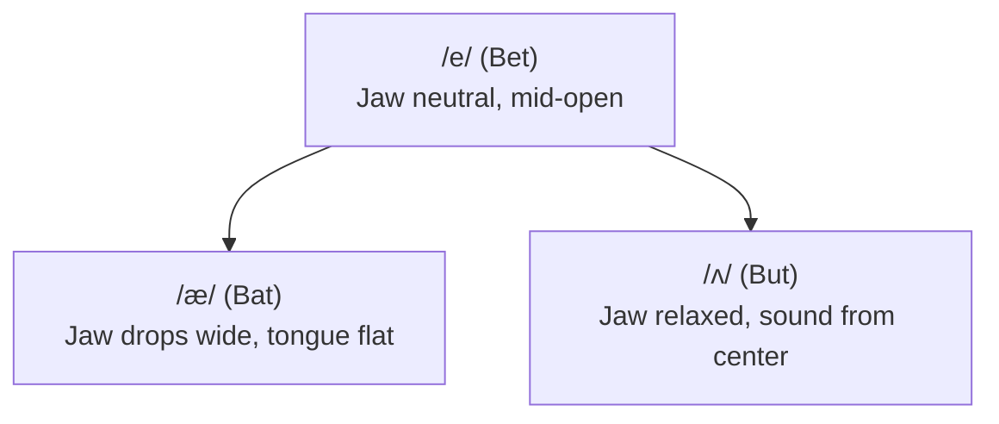

In English, vowel pronunciation is defined by two fundamental concepts that do not exist in Ukrainian: **vowel length/tenseness** and **vowel reduction**.

While Ukrainian vowels remain crisp, clear, and uniform regardless of stress, English vowels change their entire identity depending on whether they are in a stressed or unstressed syllable.

---

## ⚡ The Tense vs Lax Distinction (Minimal Pairs)

A common pitfall for English learners is treating tense and lax vowels as the same sound. In English, confusing vowel length changes the word entirely:

| Lax (Short & Relaxed) | Example | Tense (Long & Muscular) | Example | Meaning Shift |
| :--- | :--- | :--- | :--- | :--- |
| **/ɪ/** (loose jaw) | **Ship** `/ʃɪp/` | **/iː/** (smiling tension) | **Sheep** `/ʃiːp/` | *The ship transports the sheep.* |
| **/ʊ/** (soft lips) | **Pull** `/pʊl/` | **/uː/** (tight circle lips) | **Pool** `/puːl/` | *Pull me out of the pool.* |
| **/e/** (neutral mid) | **Men** `/men/` | **/eɪ/** (dynamic glide) | **Main** `/meɪn/` | *The main group of men.* |
| **/ʌ/** (short central) | **Cut** `/kʌt/` | **/ɑː/** (deep open throat) | **Cart** `/kɑːt/` | *Cut the wood for the cart.* |
| **/ɒ/ or /ɑ/** | **Cot** `/kɑːt/` | **/ɔː/** (rounded back) | **Caught** `/kɔːt/` | *He was caught on the cot.* |

> [!TIP]
> **Physical Muscle Check for `/iː/` vs `/ɪ/`**:
> - For **/iː/** (*sheep, eat, sleep*): Pull the corners of your lips back into an exaggerated smile. Feel the tension in your cheeks.
> - For **/ɪ/** (*ship, it, slip*): Let your jaw drop slightly and relax all facial muscles. The tongue sits in the middle. It should sound halfway between Ukrainian «і» and «и».

---

## 🎯 The Bat - Bet - But Triangle

For Ukrainian speakers, distinguishing between `/æ/`, `/e/`, and `/ʌ/` is the single biggest phonetic obstacle. Notice how the jaw drops progressively lower:



| Sound | Keyword | Mouth Position | Drill Sentence |
| :---: | :--- | :--- | :--- |
| **/e/** | **Bet** `/bet/` | Neutral jaw opening, tongue raised slightly | *"I bet you have ten pens."* |
| **/æ/** | **Bat** `/bæt/` | Jaw drops down wide, corners of mouth open, tongue flat | *"The fat cat sat on the black mat."* |
| **/ʌ/** | **But** `/bʌt/` | Relaxed mid jaw, short gut punch sound | *"Cut the cup with courage."* |

---

## 👑 The King of English: The Schwa `/ə/`

The **Schwa** `/ə/` is the single most common sound in spoken English. Over **30% of all vowel occurrences** in natural English conversation are schwas!

### What is a Schwa?
- A schwa is an **unstressed, effortless, completely relaxed vowel**.
- It requires zero muscular tension. You simply open your mouth slightly and let sound escape without moving your lips, tongue, or jaw.

```
Neutral resting position ➔ Gentle vocal cord sound ➔ /ə/
```

### The Magic of Vowel Reduction
In English, almost **any written vowel** (A, E, I, O, U) will turn into a Schwa when it lands in an **unstressed syllable**:

| Word | Written Letter | Phonetic IPA | Where the Schwa Hides |
| :--- | :---: | :--- | :--- |
| **Banana** | **A** | `/b**ə**ˈnæn.**ə**/` | The 1st and 3rd "a" collapse into `/ə/`. Only the stressed middle "a" is `/æ/`. |
| **Doctor** | **O** | `/ˈdɑːk.t**ɚ**/` | The "o" is never pronounced as an "o"; it reduces to an R-colored Schwa. |
| **Support** | **U** | `/**sə**ˈpɔːrt/` | The "u" is reduced so heavily it almost disappears: *s-PORT*. |
| **Pencil** | **I** | `/ˈpen.s**ə**l/` | The "i" softens into `/əl/`. |
| **Problem** | **E** | `/ˈprɑː.bl**ə**m/` | The "e" reduces to an effortless murmur. |

> [!CAUTION]
> **The Golden Law of the Schwa**:
> Never, ever stress a syllable containing a Schwa. Stressing a Schwa immediately sounds foreign and breaks the natural rhythm of English sentences.

---

## 📚 Sound System Navigation

- **[IPA Atlas (All 44 Sounds)](/phonetics/ipa-chart/)**: The full phonetic matrix overview.
- **[Diphthongs & Glides](/phonetics/diphthongs/)**: Two-vowel glides and rhotic R combinations.
- **[Consonants & Challenging Sounds](/phonetics/consonants/)**: Overcome TH, W vs V, and the Flap T.
- **[Connected Speech & Rhythm](/phonetics/connected-speech/)**: How words fuse into smooth sentences.

---

<div class="references-box">
  <div class="references-title">
    <svg class="references-icon" width="20" height="20" viewBox="0 0 24 24" fill="none" stroke="currentColor" stroke-width="2">
      <path d="M4 19.5A2.5 2.5 0 0 1 6.5 17H20"></path>
      <path d="M6.5 2H20v20H6.5A2.5 2.5 0 0 1 4 19.5v-15A2.5 2.5 0 0 1 6.5 2z"></path>
    </svg>
    <span>Interactive Online References & Vowel Practice Tools</span>
  </div>
  <ul class="references-list">
    <li><a href="https://grammarway.com/reading-rules" target="_blank" rel="noopener noreferrer">GrammarWay: 4 Syllable Types & Vowel Rules</a> — complete reference for open, closed, and R-controlled vowel syllables.</li>
    <li><a href="https://grammarway.com/phonetics" target="_blank" rel="noopener noreferrer">GrammarWay: English Phonetics & Vowel Charts</a> — comprehensive vowel and Schwa `/ə/` explanations and audio-ready guides.</li>
    <li><a href="https://www.ipachart.com/" target="_blank" rel="noopener noreferrer">IPAChart.com Interactive Soundboard</a> — audio trainer to contrast short lax vs long tense monophthongs.</li>
    <li><a href="https://youglish.com/" target="_blank" rel="noopener noreferrer">YouGlish English Pronunciation</a> — listen to target vowel sounds across hundreds of thousands of authentic video clips.</li>
  </ul>
</div>

