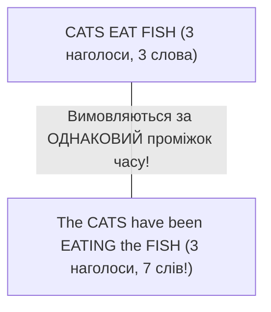

Головний шок для українців у живому спілкуванні з американцями — носії мови не вимовляють слова окремо, як у словнику. Коли слова складаються в речення, **вони буквально перетікають одне в одне без жодних пауз**.

Розуміння **зв'язного мовлення (connected speech)** та **ритму наголосів (stress-timed rhythm)** — це головний секрет, який дозволяє легко розуміти фільми на слух і звучати плавно та невимушено.

---

## 🎵 Складовий ритм проти Ритму наголосів

- **Українська мова — складова (Syllable-Timed)**: Кожен склад у реченні займає приблизно однаковий час для вимови, немов ноти на піаніно: *«Ко-жен склад зву-чить од-на-ко-во»*.
- **Англійська мова — ритмічна (Stress-Timed)**: Час між **наголошеними складами є однаковим**, незалежно від того, скільки ненаголошених службових слів заховано між ними!

Щоб втиснути 7 слів у той самий часовий проміжок, що й 3 слова, носії мови стискають службові слова (артиклі, прийменники, допоміжні дієслова) у так звані **слабкі форми (weak forms)**.

---

## 📉 Слабкі форми та скорочення

У реченні другорядні слова втрачають свої повні голосні звуки та скочуються до розслабленого **Шва `/ə/`**:

| Слово | Сильна форма (окремо) | Слабка форма (у реченні) | Як це звучить у мовному потоці |
| :--- | :---: | :---: | :--- |
| **To** | `/tuː/` | **/tə/** | *"I want to go"* → `/aɪ ˈwɑːn.tə ɡoʊ/` |
| **For** | `/fɔːr/` | **/fɚ/** | *"This is for you"* → `/ðɪs ɪz fɚ juː/` |
| **And** | `/ænd/` | **/ən/** або **/n/** | *"Rock and roll"* → `/ˌrɑːk.n̩ˈroʊl/` |
| **Can** | `/kæn/` | **/kən/** | *"I can do it"* → `/aɪ kən ˈduː ɪt/` |
| **Of** | `/ʌv/` | **/əv/** | *"Cup of coffee"* → `/ˈkʌp.əv ˈkɔː.fi/` |
| **Are** | `/ɑːr/` | **/ɚ/** | *"What are you doing?"* → `/wʌt̬ ɚ jə ˈduː.ɪŋ/` |

> [!TIP]
> Зверніть увагу: стверджувальне дієслово **Can** редукується до легкого `/kən/`, але заперечне **Can't** НІКОЛИ не скорочується (`/kænt/`). Саме за цією різницею носії мови безпомилково розрізняють «можу» та «не можу» на слух!

---

## 🔗 3 золоті правила злиття слів (Linking)

Англійська мова — це безперервна звукова стрічка. Звуки переходять через межі слів за чіткими законами:

### 1. Приголосний + Голосний (Пряме перетікання)
Якщо слово закінчується на приголосний, а наступне починається з голосного, кінцевий приголосний перестрибує до другого слова:
- **Hold on** → вимовляється як *Хол-дон* `/hoʊlˈdɑːn/`
- **Check it out** → вимовляється як *Че-кі-даут* `/ˌtʃek.ɪˈt̬aʊt/`
- **Not at all** → вимовляється як *Но-те-тол* `/ˌnɑː.t̬əˈtɔːl/`

### 2. Голосний + Голосний (З'єднувальні звуки-привиди)
Коли зустрічаються два голосних звуки, щоб не робити паузи, мовний апарат додає непомітний плавний звук **[w]** або **[j]**:
- Якщо перше слово закінчується круглими губами (O, U), додається плавний звук **[w]**:
  - *"Go away"* → звучить як *Go-**w**-away* `/ˌɡoʊ.w.əˈweɪ/`
  - *"Do it"* → звучить як *Do-**w**-it* `/ˈduː.w.ɪt/`
- Якщо перше слово закінчується звуками (EE, AY, I), додається легкий звук **[j]**:
  - *"I am"* → звучить як *I-**y**-am* `/aɪ.j.æm/`
  - *"See it"* → звучить як *See-**y**-it* `/ˈsiː.j.ɪt/`

### 3. Елізія (Випадання звуків)
Коли звуки /t/ або /d/ опиняються затиснутими між іншими приголосними, вони зникають:
- **Last night** → звучить як *Las’ night* `/læs ˈnaɪt/`
- **Next door** → звучить як *Nex’ door* `/neks ˈdɔːr/`

---

## 🔍 Розбір транскрипцій реальних розмовних речень

Ось як насправді звучать звичні фрази у швидкій та невимушеній розмовній англійській:

### 1. *"What are you going to do?"* (Що ти збираєшся робити?)
- **Словникова вимова окремих слів**: `/wʌt ɑːr juː ˈɡoʊ.ɪŋ tuː duː/`
- **Жива розмовна мова**: **`/ˈwʌ.tʃə ɡʌ.nə ˈduː/`** (*Whatcha gonna do?*)
- **Що відбувається**: "What are you" зливається в єдине `/wʌtʃə/`, а "going to" редукується до розмовного `/ɡʌnə/`.

### 2. *"I should have told you earlier."* (Мені варто було сказати тобі раніше.)
- **Словникова вимова окремих слів**: `/aɪ ʃʊd hæv toʊld juː ˈɜːr.li.ɚ/`
- **Жива розмовна мова**: **`/aɪ ʃʊ.də ˈtoʊl.dʒu ˈɜːr.li.ɚ/`**
- **Що відбувається**: "Should have" перетворюється на легке *shoulda* `/ʃʊdə/`. Звук /d/ у слові "told" зливається з початковим /j/ слова "you", утворюючи африкату [dʒ] (*told-you* → *tol-joo*).

### 3. *"Could you give me a hand?"* (Чи міг би ти мені допомогти?)
- **Словникова вимова окремих слів**: `/kʊd juː ɡɪv miː ə hænd/`
- **Жива розмовна мова**: **`/kʊ.dʒə ˈɡɪv.mi.ə ˈhænd/`**
- **Що відбувається**: "Could you" асимілюється у звичне для слуху *could-juh* `/kʊdʒə/`. "Give me" зв'язується з артиклем у єдиний трискладовий блок.

### 4. *"Do you want a cup of coffee?"* (Хочеш чашку кави?)
- **Словникова вимова окремих слів**: `/duː juː wɑːnt ə kʌp ʌv ˈkɔː.fi/`
- **Жива розмовна мова**: **`/də.jə ˈwɑː.nə ˈkʌ.pə ˈkɔː.fi/`** (*D'ya wanna cuppa coffee?*)
- **Що відбувається**: У "want a" звук /t/ відкидається і стає *wanna* `/wɑːnə/`. Зворот "cup of" перетворюється на зручне для мовного апарату *cuppa* `/kʌpə/`.

---

## 📚 Навігація розділу вимови

- **[Атлас IPA (Усі 44 звуки)](/uk/phonetics/ipa-chart/)**: Загальна таблиця всіх 44 звуків.
- **[Голосні та Шва /ə/](/uk/phonetics/vowels/)**: Довгота голосних та найважливіший ненаголошений звук.
- **[Дифтонги та плавні звуки](/uk/phonetics/diphthongs/)**: Ковзання звуків та американські сполуки з R.
- **[Приголосні та підступні звуки](/uk/phonetics/consonants/)**: Постановка міжзубних TH, губного W та Flap T.
