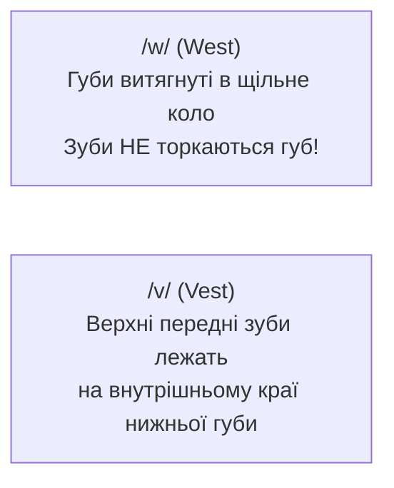

В англійській мові **24 приголосні фонеми**. Хоча багато з них (як /m, b, d, s/) мають близькі українські аналоги, кілька ключових звуків взагалі відсутні в українській фонетиці й вимагають формування абсолютно нової м'язової пам'яті.

Правильна постановка цих кількох звуків миттєво знімає важкий акцент і робить вашу мову кришталево чистою та зрозумілою для носіїв.

---

## 1. Звуки TH: `/θ/` та `/ð/`

Буквосполучення **TH** дає два унікальні міжзубні звуки. Для вимови обох покладіть кінчик язика **між верхніми та нижніми зубами**:

1. **Глухий `/θ/`** — чистий легкий видих повітря (голосові зв'язки спокійні, у горлі немає вібрації).
2. **Дзвінкий `/ð/`** — язик у тій самій позиції, але голосові зв'язки вібрують із відчутним дзижчанням у шиї.

### 🎬 Відеоурок: Положення рота та язика

  <iframe 
    src="https://www.youtube.com/embed/b4wH70sV14w" 
    title="English: How to Pronounce TH Consonants [θ] + [ð]" 
    allow="accelerometer; autoplay; clipboard-write; encrypted-media; gyroscope; picture-in-picture; web-share" 
    allowfullscreen
  ></iframe>

  📺 <em>Якщо відео не відображається: <a href="https://www.youtube.com/watch?v=b4wH70sV14w" target="_blank" rel="noopener noreferrer" style="color: var(--accent-blue-primary);">Дивитися безпосередньо на YouTube</a></em>

### Таблиця контрастів: Глухий проти Дзвінкого TH

| Глухий `/θ/` (Тихий шепіт) | Значення | Дзвінкий `/ð/` (Вібрація зв'язок) | Значення |
| :--- | :--- | :--- | :--- |
| **Think** `/θɪŋk/` | Думати | **This** `/ðɪs/` | Цей / Ця / Це |
| **Three** `/θriː/` | Три (число) | **That** `/ðæt/` | Той / Та / Те |
| **Thanks** `/θæŋks/` | Дякую | **The** `/ðə/` | Означений артикль |
| **Bath** `/bæθ/` | Ванна | **Breathe** `/briːð/` | Дихати |
| **Birthday** `/ˈbɝːθ.deɪ/` | День народження | **Mother** `/ˈmʌð.ɚ/` | Мама |

> [!CAUTION]
> **Категорично заборонено**:
> Не замінюйте звук `/θ/` на українське **[с]** (*"sink"* замість *"think"*) або **[ф]** (*"free"* замість *"three"*).
> Не замінюйте звук `/ð/` на українське **[з]** (*"zis"* замість *"this"*).

---

## 2. Битва титанів: W проти V

В українській мові літери «в» та «у» часто чергуються, але в англійській мові плутанина між **/w/** та **/v/** утворює абсолютно різні слова:

| Пара слів | Слово з /w/ (Круглі губи) | Слово з /v/ (Зуби на губі) | Зміна значення |
| :--- | :--- | :--- | :--- |
| **West vs Vest** | **West** `/west/` (Захід) | **Vest** `/vest/` (Жилетка) | *Go west in your vest.* |
| **Wet vs Vet** | **Wet** `/wet/` (Мокрий) | **Vet** `/vet/` (Ветеринар) | *The wet dog bit the vet.* |
| **Wine vs Vine** | **Wine** `/waɪn/` (Вино) | **Vine** `/vaɪn/` (Лоза) | *Fine wine from the vine.* |
| **Wary vs Very** | **Wary** `/ˈwer.i/` (Обережний) | **Very** `/ˈver.i/` (Дуже) | *Be very wary.* |

> [!TIP]
> **М'язова вправа для `/w/`**:
> Уявіть, що ви збираєтеся свистіти або когось поцілувати. Витягніть губи вперед у трубочку. Почніть видихати звук, і лише після цього розкривайте рот у голосний: *W-W-Water*.

---

## 3. Рідкий звук R
 
В українській мові літера «Р» — це дзвінкий дрижачий звук (кінчик язика активно вібрує біля піднебіння).
В англійській мові **кінчик язика ніколи не торкається піднебіння й не вібрує**:

- **Позиція язика**: Тіло язика відтягується назад до горла, бокові краї спинки притискаються до верхніх корінних зубів.
- Кінчик язика вільно висить посередині порожнини рота без дотику до зубів чи піднебіння.
- **Тренувальні слова**: *Red, Right, Road, Star, Car, Water*.

---

## 4. Світлий L проти Темного L

В англійській мові літера L має дві принципово різні позиції вимови:

| Тип звука | Де зустрічається | Як вимовляти | Приклади слів |
| :--- | :--- | :--- | :--- |
| **Світлий L** | На початку слова (перед голосним) | Кінчик язика торкається ясен за верхніми зубами; звук легкий і дзвінкий | *light, love, listen, yellow* |
| **Темний L** | У кінці слова або перед іншим приголосним | Задня частина язика підіймається до м'якого піднебіння (веляризація); глибокий горловий звук | *milk, feel, ball, table, Apple* |

> [!NOTE]
> Якщо сказати слово *feel* з українським м'яким «ль» (*філь*), це відразу звучить неприродно. Опустіть спинку язика та створіть глибокий, темний звук у горлі.

---

## 5. Звук Flap T та гортанна змичка

У повсякденній розмовній англійській мові літера **T** між голосними часто вимовляється не як жорстке [т], а м'якше:

1. **Flap T**: Коли звук [t] стоїть між голосними (за умови наголосу на першому складі), язик робить блискавичний поодинокий дотик до піднебіння (подібно до швидкого поодинокого звука «р»):
   - **Water** → звучить як *ВО-дер*
   - **Better** → звучить як *БЕ-дер*
   - **City** → звучить як *СІ-ді*
   - **Party** → звучить як *ПАР-ді*

2. **Гортанна змичка**: Коли після T йде ненаголошений склад із звуком /n/, носії мови перекривають зв'язки в горлі, утворюючи мікропаузу:
   - **Button** → *ба-’н*
   - **Mountain** → *маун-’н*
   - **Important** → *ім-пор-’нт*

---

## 6. Німі приголосні (Не читаються на письмі!)

Англійська мова зберегла написання слів з часів Середньовіччя. Ніколи не вимовляйте ці літери:

| Німа літера | Приклади слів | Як насправді звучить |
| :---: | :--- | :--- |
| **B** | *doubt, debt, thumb, climb, lamb* | Літера «b» повністю мовчить (*daut, det, thum*). |
| **K** | *knife, know, knee, knock, knight* | Починаємо читання одразу зі звука [n] (*nife, no*). |
| **L** | *calm, walk, talk, half, salmon* | Літера «l» взагалі не вимовляється (*cahm, wok, tok, hahf*). |
| **P** | *psychology, pneumonia, receipt* | Починається зі звуків [s] чи [n] (*sychology, receet*). |
| **S** | *island, aisle, debris* | Літера «s» невидима (*eye-land, eye-l*). |
| **W** | *write, wrong, answer, sword* | Читається одразу як [r] або [s] (*rite, rong, sord*). |

---

## 📚 Навігація розділу вимови

- **[Атлас IPA (Усі 44 звуки)](/uk/phonetics/ipa-chart/)**: Загальна карта фонетичних символів.
- **[Голосні та Шва /ə/](/uk/phonetics/vowels/)**: Довгота голосних та найважливіший ненаголошений звук.
- **[Дифтонги та плавні звуки](/uk/phonetics/diphthongs/)**: Ковзання звуків та сполуки з R.
- **[Зв'язне мовлення та ритм](/uk/phonetics/connected-speech/)**: Злиття слів у реченні та природна швидкість мовлення.

---

  

    <svg class="references-icon" width="20" height="20" viewBox="0 0 24 24" fill="none" stroke="currentColor" stroke-width="2">
      <path d="M4 19.5A2.5 2.5 0 0 1 6.5 17H20"></path>
      <path d="M6.5 2H20v20H6.5A2.5 2.5 0 0 1 4 19.5v-15A2.5 2.5 0 0 1 6.5 2z"></path>
    </svg>
    Інтерактивні онлайн-довідники та тренажери вимови
  

  <ul class="references-list">
    <li><a href="https://grammarway.com/reading-rules" target="_blank" rel="noopener noreferrer">GrammarWay: Правила читання англійських літер</a> — посібник з правил вимови приголосних, німих літер та буквосполучень (th, sh, ch, ph, wh).</li>
    <li><a href="https://grammarway.com/phonetics" target="_blank" rel="noopener noreferrer">GrammarWay: Фонетика та звуки англійської мови</a> — повна таблиця фонетичних знаків з україномовними коментарями та прикладами.</li>
    <li><a href="https://www.ipachart.com/" target="_blank" rel="noopener noreferrer">IPAChart.com Interactive Soundboard</a> — інтерактивна таблиця з можливістю прослухати звучання кожного приголосного символу.</li>
    <li><a href="https://youglish.com/" target="_blank" rel="noopener noreferrer">YouGlish English Pronunciation</a> — пошук вимови будь-яких приголосних слів у реальних відеоконтекстах носіїв мови.</li>
  </ul>

