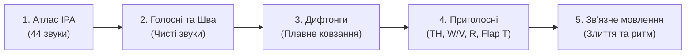

В англійській мові всього **26 літер**, але вони утворюють **44 окремі звуки (фонеми)**. Оскільки англійський правопис є історичним, а не фонетичним («пишеться Манчестер, а читається Ліверпуль»), **Міжнародний фонетичний алфавіт (IPA)** — це ваша універсальна інструкція, яка показує, як саме повинен працювати мовний апарат для будь-якого слова.

---

## 🧭 Як читати знаки транскрипції IPA

Перед вивченням звуків запам'ятайте головні службові символи:

| Символ | Назва | Приклад | Практичне значення |
| :--- | :--- | :--- | :--- |
| **`ˈ`** | Головний наголос | **/ˈæp.əl/** (*apple*) | Склад одразу після цього знака вимовляється з максимальною силою та висотою тону |
| **`ˌ`** | Побічний наголос | **/ˌʌn.dɚˈstænd/** (*understand*) | М'якший ритмічний удар перед головним наголосом |
| **`.`** | Межа складів | **/kəmˈpjuː.tɚ/** (*computer*) | Відокремлює усні склади один від одного |
| **`ː`** | Довгота звука | **/iː/** (*sheep*) | Голосний тягнеться відчутно довше, ніж короткий розслаблений звук |

---

## 🔤 Повна матриця 44 звуків

### 1. Чисті голосні (12 монофтонгів)
Одиночні, статичні звуки без зміни форми губ і язика під час вимови.

| IPA | Назва звука | Ключове слово | Артикуляція та відмінність |
| :---: | :--- | :--- | :--- |
| **/iː/** | Довгий E | **see**, *machine, beat* | Високий передній, губи розтягнуті в напруженій усмішці |
| **/ɪ/** | Короткий I | **sit**, *gym, myth* | Високо-середній, повністю розслаблений звук (між «і» та «и») |
| **/e/** чи **/ɛ/** | Короткий E | **bed**, *head, said* | Середній передній, природно відкрита щелепа |
| **/æ/** | Широкий A | **cat**, *apple, black* | Низький передній, щелепа широко опущена, спинка язика плоска |
| **/ɑː/** | Глибокий A | **father**, *car, calm* | Низький задній, найглибший горловий звук |
| **/ɔː/** | Округлий O | **law**, *caught, talk* | Середньо-низький задній, губи округлені |
| **/ʊ/** | Короткий U | **book**, *put, could* | Високо-середній, м'який розслаблений звук (не український твердий «у») |
| **/uː/** | Довгий U | **blue**, *food, shoe* | Високий задній, губи щільно зібрані в коло |
| **/ʌ/** | Короткий U | **cup**, *love, sun* | Середньо-центральний, нейтрально відкритий звук |
| **/ɜːr/** | Ротичний ER | **bird**, *learn, work* | Середній центральний, кінчик язика закручений назад для звука «R» |
| **/ə/** | Шва (Schwa) | **about**, *banana, sofa* | Повністю ненаголошений, розслаблений, нейтральний звук |
| **/ɚ/** | R-Шва | **mother**, *doctor, butter* | Ненаголошений редукований звук з легким призвуком «R» |

👉 *Для тренування протиставлення довгих/коротких звуків та трикутника Bat-Bet-But переходьте до [Голосні та Шва /ə/](/uk/phonetics/vowels/).*

---

### 2. Плавні звуки (8 дифтонгів)
Один склад, у якому язик плавно ковзає від одного звука до іншого.

| IPA | Напрямок переходу | Ключове слово | Особливість вимови |
| :---: | :---: | :--- | :--- |
| **/eɪ/** | [e] ➔ [ɪ] | **make**, *face, day* | Відкрито-середній плавно переходить у легку усмішку [ɪ] |
| **/oʊ/** | [o] ➔ [ʊ] | **go**, *boat, home* | Задній [o] плавно завершується округленням губ [ʊ] |
| **/aɪ/** | [a] ➔ [ɪ] | **time**, *high, fly* | Глибокий відкритий звук підіймається до легкого високого [ɪ] |
| **/aʊ/** | [a] ➔ [ʊ] | **now**, *mouth, out* | Відкритий звук завершується швидким стисненням губ у коло |
| **/ɔɪ/** | [ɔ] ➔ [ɪ] | **boy**, *noise, join* | Глибокий округлий [ɔ] перетікає в усміхнений [ɪ] |
| **/ɪr/** | [ɪ] ➔ [ɚ] | **near**, *here, beer* | Високий передній звук переходить у ротичний R |
| **/ɛr/** | [ɛ] ➔ [ɚ] | **square**, *care, air* | Середній відкритий звук переходить у ротичний R |
| **/ɔr/** | [ɔ] ➔ [ɚ] | **north**, *door, warm* | Округлий звук переходить у ротичний R |

👉 *Правило тривалості 70/30 та усунення слов'янського акценту розібрано у розділі [Дифтонги та плавні звуки](/uk/phonetics/diphthongs/).*

---

### 3. Приголосні (24 звуки)
Побудовані парами: глухі (лише видих повітря) та дзвінкі (вібрація голосових зв'язок).

| Група | Глухі (лише повітря) | Дзвінкі (вібрація зв'язок) | Підказка для українця |
| :--- | :--- | :--- | :--- |
| **Проривні** | **/p/** (*pen*), **/t/** (*ten*), **/k/** (*cat*) | **/b/** (*bed*), **/d/** (*dog*), **/ɡ/** (*get*) | Англійські /p, t, k/ обов'язково вимовляються з придихом |
| **Щілинні** | **/f/** (*fish*), **/s/** (*sun*), **/ʃ/** (*ship*), **/h/** (*hat*) | **/v/** (*van*), **/z/** (*zoo*), **/ʒ/** (*vision*) | Тертя повітря об зуби, ясна або губи |
| **Міжзубні щілинні** | **/θ/** (*think, three*) | **/ð/** (*this, that, mother*) | Кінчик язика між передніми зубами; не замінювати на «с» чи «з» |
| **Африкати** | **/tʃ/** (*chair, watch*) | **/dʒ/** (*judge, bridge*) | Миттєвий вибух, що переходить у плавне тертя |
| **Носові** | — | **/m/** (*man*), **/n/** (*no*), **/ŋ/** (*sing, ring*) | Повітря виходить виключно через ніс |
| **Апроксиманти** | — | **/w/** (*water*), **/r/** (*red*), **/l/** (*light*), **/j/** (*yes*) | Плавні сонорні звуки, подібні до голосних |

👉 *Відеоінструкції та вправи для TH, різниці W та V, звука R та Flap T зібрані у розділі [Приголосні та підступні звуки](/uk/phonetics/consonants/).*

---

## 🎧 5 сходинок звукової системи

1. **[Атлас IPA (Усі 44 звуки)](/uk/phonetics/ipa-chart/)**: Загальна карта та орієнтир для читання транскрипцій.
2. **[Голосні та Шва /ə/](/uk/phonetics/vowels/)**: Довгота голосних, розслаблені звуки та найважливіший звук англійської мови.
3. **[Дифтонги та плавні звуки](/uk/phonetics/diphthongs/)**: Механіка ковзання голосних та ротичні дифтонги.
4. **[Приголосні та підступні звуки](/uk/phonetics/consonants/)**: Постановка міжзубних TH, губного W проти зубогубного V та темного L.
5. **[Зв'язне мовлення та ритм](/uk/phonetics/connected-speech/)**: Як слова поєднуються в живому потоці мови без пауз.

---

  

    <svg class="references-icon" width="20" height="20" viewBox="0 0 24 24" fill="none" stroke="currentColor" stroke-width="2">
      <path d="M4 19.5A2.5 2.5 0 0 1 6.5 17H20"></path>
      <path d="M6.5 2H20v20H6.5A2.5 2.5 0 0 1 4 19.5v-15A2.5 2.5 0 0 1 6.5 2z"></path>
    </svg>
    Інтерактивні онлайн-ресурси для вимови
  

  <ul class="references-list">
    <li><a href="https://grammarway.com/phonetics" target="_blank" rel="noopener noreferrer">GrammarWay: Фонетика та звуки англійської мови</a> — повноцінний довідник з описом кожного фонетичного символу, транскрипції та правил артикуляції.</li>
    <li><a href="https://www.ipachart.com/" target="_blank" rel="noopener noreferrer">Interactive IPA Chart (ipachart.com)</a> — інтерактивна звукова карта: клікайте на будь-який символ IPA та слухайте професійний запис кожного звука.</li>
    <li><a href="https://dictionary.cambridge.org/" target="_blank" rel="noopener noreferrer">Cambridge English Dictionary</a> — офіційні транскрипції та аудіовимова для кожного англійського слова.</li>
    <li><a href="https://youglish.com/" target="_blank" rel="noopener noreferrer">YouGlish English Pronunciation</a> — послухайте вимову будь-якого слова реальними людьми у тисячах відео з усього світу.</li>
  </ul>

