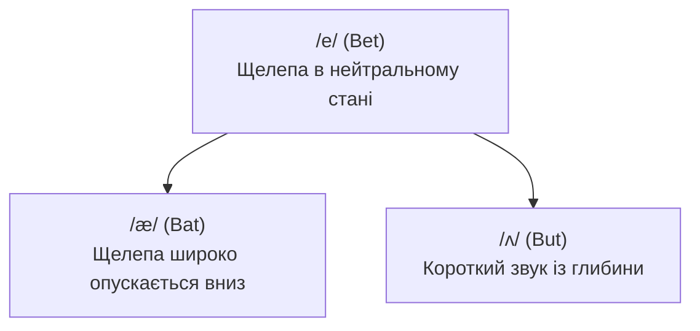

В англійській вимові голосних діють два фундаментальні закони, яких немає в українській мові: **напруженість/довгота звука** та **редукція голосних**.

В українській мові кожна голосна літера звучить чітко й виразно незалежно від наголосу («молоко» ми вимовляємо з трьома чіткими «о»). В англійській мові голосний повністю змінює свою природу залежно від того, чи падає на нього наголос.

---

## ⚡ Напружені проти розслаблених звуків (Мінімальні пари)

Типова помилка початківців — вимовляти англійські парні голосні однаково. В англійській мові довгота та напруженість звука повністю змінює сенс слова:

| Розслаблений (короткий) | Приклад | Напружений (довгий) | Приклад | Зміна значення |
| :--- | :--- | :--- | :--- | :--- |
| **/ɪ/** (щелепа вільна) | **Ship** `/ʃɪp/` | **/iː/** (напружена посмішка) | **Sheep** `/ʃiːp/` | *Корабель (ship) перевозить овець (sheep).* |
| **/ʊ/** (м'які губи) | **Pull** `/pʊl/` | **/uː/** (губи в щільне коло) | **Pool** `/puːl/` | *Витягни мене (pull) з басейну (pool).* |
| **/e/** (нейтральна щелепа) | **Men** `/men/` | **/eɪ/** (плавний дифтонг) | **Main** `/meɪn/` | *Головна (main) група чоловіків (men).* |
| **/ʌ/** (короткий удар) | **Cut** `/kʌt/` | **/ɑː/** (глибоке відкрите горло) | **Cart** `/kɑːt/` | *Розріж (cut) деревину для воза (cart).* |
| **/ɒ/ чи /ɑ/** | **Cot** `/kɑːt/` | **/ɔː/** (округлий задній) | **Caught** `/kɔːt/` | *Його спіймали (caught) на розкладачці (cot).* |

> [!TIP]
> **Фізична перевірка м'язів для `/iː/` проти `/ɪ/`**:
> - Для **/iː/** (*sheep, eat, sleep*): Розтягніть куточки губ у широку, відчутно напружену посмішку. Ви маєте відчути напруження в щоках.
> - Для **/ɪ/** (*ship, it, slip*): Злегка опустіть щелепу й повністю розслабте обличчя. Звук народжується посередині — між українськими «і» та «и».

---

## 🎯 Трикутник Bat - Bet - But

Для українського слуху розрізнення звуків `/æ/`, `/e/` та `/ʌ/` — це головний виклик. Зверніть увагу, як поступово опускається щелепа:



| Звук | Ключове слово | Положення рота | Тренувальна фраза |
| :---: | :--- | :--- | :--- |
| **/e/** | **Bet** `/bet/` | Звичайне відкриття щелепи, кінчик язика біля нижніх зубів | *"I bet you have ten pens."* |
| **/æ/** | **Bat** `/bæt/` | Щелепа опускається дуже широко, язик лежить плоско | *"The fat cat sat on the black mat."* |
| **/ʌ/** | **But** `/bʌt/` | Розслаблена середня позиція, звук нагадує легкий видих | *"Cut the cup with courage."* |

---

## 👑 Король англійських звуків: Шва `/ə/`

Звук **Шва (Schwa)** `/ə/` — найпоширеніший звук в усій англійській мові. Понад **30% усіх голосних звуків** у живій розмові — це саме Шва!

### Що таке звук Шва?
- Це **ненаголошений, максимально розслаблений звук**.
- Для його створення не потрібно напружувати жоден м'яз обличчя. Ви просто злегка відкриваєте рот і видихаєте звук: щось середнє між розмитим «е», «а» та «и».

```
Повний спокій обличчя ➔ Легкий подих голосу ➔ /ə/
```

### Магія редукції голосних
В англійській мові практично **будь-яка голосна літера** (A, E, I, O, U) у ненаголошеному складі перетворюється на Шва:

| Слово | Літера на письмі | Транскрипція IPA | Де ховається Шва |
| :--- | :---: | :--- | :--- |
| **Banana** | **A** | `/b**ə**ˈnæn.**ə**/` | Перша та остання «а» редукуються у `/ə/`. Тільки середня ударна «а» звучить як `/æ/`. |
| **Doctor** | **O** | `/ˈdɑːk.t**ɚ**/` | Літера «o» ніколи не звучить як «о»; вона зливається в ротичний Шва. |
| **Support** | **U** | `/**sə**ˈpɔːrt/` | Літера «u» редукується настільки, що майже зникає: чутно коротке *с-ПОРТ*. |
| **Pencil** | **I** | `/ˈpen.s**ə**l/` | Ненаголошена «i» пом'якшується до ледь помітного `/əl/`. |
| **Problem** | **E** | `/ˈprɑː.bl**ə**m/` | Літера «e» стає ненаголошеним подихом. |

> [!CAUTION]
> **Золоте правило звука Шва**:
> Ніколи не робіть наголос на складі зі звуком Шва. Наголос на Шва миттєво створює неприродний іноземний акцент і ламає музичний ритм речення.

---

## 📚 Навігація розділу вимови

- **[Атлас IPA (Усі 44 звуки)](/uk/phonetics/ipa-chart/)**: Загальна карта фонетичних символів.
- **[Дифтонги та плавні звуки](/uk/phonetics/diphthongs/)**: Ковзання звуків та сполуки з R.
- **[Приголосні та підступні звуки](/uk/phonetics/consonants/)**: Постановка звуків TH, різниця між W та V, та швидкий Flap T.
- **[Зв'язне мовлення та ритм](/uk/phonetics/connected-speech/)**: Злиття слів у реченні та природна швидкість мовлення.

---

<div class="references-box">
  <div class="references-title">
    <svg class="references-icon" width="20" height="20" viewBox="0 0 24 24" fill="none" stroke="currentColor" stroke-width="2">
      <path d="M4 19.5A2.5 2.5 0 0 1 6.5 17H20"></path>
      <path d="M6.5 2H20v20H6.5A2.5 2.5 0 0 1 4 19.5v-15A2.5 2.5 0 0 1 6.5 2z"></path>
    </svg>
    <span>Інтерактивні онлайн-довідники та тренажери голосних</span>
  </div>
  <ul class="references-list">
    <li><a href="https://grammarway.com/reading-rules" target="_blank" rel="noopener noreferrer">GrammarWay: 4 типи складів та правила читання голосних</a> — структурований посібник про відкриті, закриті та склади з буквою R.</li>
    <li><a href="https://grammarway.com/phonetics" target="_blank" rel="noopener noreferrer">GrammarWay: Голосні звуки англійської мови</a> — повна таблиця фонетичних символів голосних з розбором звука Шва /ə/.</li>
    <li><a href="https://www.ipachart.com/" target="_blank" rel="noopener noreferrer">IPAChart.com Interactive Soundboard</a> — аудіотренажер для порівняння довгих та коротких монофтонгів.</li>
    <li><a href="https://youglish.com/" target="_blank" rel="noopener noreferrer">YouGlish English Pronunciation</a> — жива вимова голосних у контексті промов, інтерв'ю та діалогів.</li>
  </ul>
</div>

