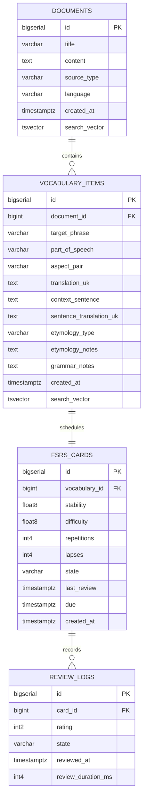

# Database & Lexical Search Standards

## 1. Database Engine & Hosting

- **Platform**: Serverless PostgreSQL on **Neon** (or local Postgres for local dev).
- **Migration & Query Layer**: `sqlx-cli` with strictly typed compile-time query verification in Rust.
- **Connection Management**: Async `PgPool` with maximum pool limits configured for serverless scale.

---

## 2. Relational Schema Design



---

## 3. Full-Text Search (Lexical Precision over Vector Bloat)

To avoid vector search inaccuracies on Slavic prefixes, roots, and inflections:

1. **PostgreSQL `tsvector` with GIN Indexes**:

```sql
ALTER TABLE documents ADD COLUMN search_vector tsvector
    GENERATED ALWAYS AS (to_tsvector('simple', title || ' ' || content)) STORED;

CREATE INDEX idx_documents_search ON documents USING GIN(search_vector);

ALTER TABLE vocabulary_items ADD COLUMN search_vector tsvector
    GENERATED ALWAYS AS (to_tsvector('simple', target_phrase || ' ' || translation_uk || ' ' || coalesce(context_sentence, ''))) STORED;

CREATE INDEX idx_vocab_search ON vocabulary_items USING GIN(search_vector);
```

2. **Querying via `websearch_to_tsquery` & Substring Fallback**:
   Queries use `plainto_tsquery` / `to_tsquery` for root matching and `ILIKE` for partial prefix matching.
