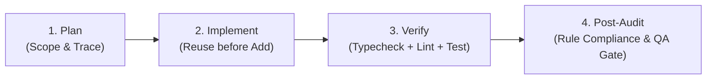

# Agentic Engineering System & Monorepo Workflow

This document details the organizational framework, rules hierarchy, skill automation, and development workflows adopted for **LangFlow**. It borrows high-maturity agentic engineering principles while tailoring them for our Rust + TypeScript + PostgreSQL + Gemini + MCP stack.

---

## 1. Core Architectural & Organizational Principles

### A. Strict Hierarchy of Truth

1. **Functional Specifications (`specs/requirements/`)**:
   - The single, authoritative source of truth for all product scope, features, and behaviors.
   - Any AI agent or developer decision on _"what to build / why / is this required"_ must trace directly to a requirement in this folder.
2. **Technical Standards (`docs/standards/`)**:
   - Defines _how_ we build: Rust, Frontend, UI/UX, AI/MCP, Database, and Monorepo standards.
3. **Working Plans (`plans/`) — Gitignored**:
   - Working artifacts for an in-progress feature or issue.
   - A plan is **never a source of truth** and is deleted once the feature/PR merges.

---

## 2. Directory & Knowledge Taxonomy

```
lang-flow/
├── AGENTS.md                   # Global agent operating rules (concise, high-level)
├── .agents/                    # Antigravity / Agentic customization root
│   ├── rules/                  # Path-scoped & domain-specific rules
│   │   ├── backend.md          # Rust Axum, Tokio, sqlx, errors, FSRS
│   │   ├── frontend.md         # React, TanStack, Chakra UI v3, compound components
│   │   ├── ai-and-mcp.md       # Gemini structured outputs, MCP tool protocol
│   │   ├── database.md         # Neon PostgreSQL, tsvector, migrations
│   │   ├── code-style.md       # Formatting, naming, zero-placeholder policy
│   │   └── dependencies.md     # Dependency management & approval policy
│   └── skills/                 # Agent procedural playbooks (slash commands)
│       ├── delivery-loop/      # Plan → Implement → Verify → Post-Audit cycle
│       ├── design-research/    # UI/UX precedent benchmarking before designing
│       ├── new-doc/            # Structured documentation generator
│       ├── qa-story/           # Acceptance verification & checklist validator
│       └── run-local/          # Local dev environment orchestration
├── specs/                      # Authoritative product specifications
│   ├── requirements/           # MVP & feature requirements
│   └── data-model/             # Canonical entity & linguistics data models
├── docs/                       # Architecture & developer guides
│   └── standards/              # Reference standards & checklists
├── templates/                  # Standardized issue, PR, and plan templates
│   ├── plan-template.md
│   └── pr-template.md
├── crates/                     # Rust backend crates (api, core, db, ai, mcp-server)
├── apps/                       # Frontend applications (web)
└── packages/                   # Shared TypeScript packages (shared-types)
```

---

## 3. The 4-Stage Delivery Loop (`/delivery-loop`)

Every feature or sub-issue delivered by an AI agent or developer follows this mandatory loop:



1. **Plan (`plans/<FEATURE-ID>.md`)**:
   - Trace scope to functional requirements.
   - **Reuse before addition**: explicitly identify existing services, helpers, or UI components before writing new ones.
   - Never write code snippets in plans — design and data flow only.
2. **Implement**:
   - Write typed, deterministic code with strict schema compliance.
   - Adhere to the zero-placeholder rule: all components are fully styled and functional.
3. **Verify**:
   - Backend: `cargo check`, `cargo clippy -- -D warnings`, `cargo test`.
   - Frontend: `pnpm typecheck`, `pnpm lint`.
4. **Post-Implementation Audit**:
   - Audit against project standards, accessibility requirements, and the acceptance checklist.
   - Fix deviations before marking ready.

---

## 4. Design Precedent Rule (`/design-research`)

- When designing a screen, control, layout, or empty state that the functional requirements do not explicitly detail:
  - **Research before designing**: Benchmark 2–4 comparable modern platforms (e.g. Linear, Raycast, Supabase, Duolingo, Anki/FSRS tools).
  - Attribute design choices to clear interaction precedents rather than subjective taste.

---

## 5. Dependency Governance (`dependencies.md`)

- **Approval Gate**: Third-party dependencies require justification. Prefer existing workspace primitives:
  - Frontend: Chakra UI v3 for UI, TanStack for routing/data-fetching, Web Speech API for TTS.
  - Backend: Tokio, Axum, sqlx, serde, thiserror.
- **Unified Versions**: Keep shared tooling and library versions synchronized across workspaces.

---

## 6. Monorepo Implementation Roadmap

Once the monorepo workspace files are generated, we will activate the following assets:

1. **`.agents/rules/`**: Symlinked / integrated domain rules for automated loading during agent sessions.
2. **`.agents/skills/`**: Interactive skills for `/delivery-loop`, `/design-research`, `/qa-story`, `/new-doc`.
3. **`specs/requirements/`**: Ingesting the Bulgarian language learning MVP specifications as versioned requirements.
4. **`templates/`**: Plan, PR, and Story Markdown templates.
